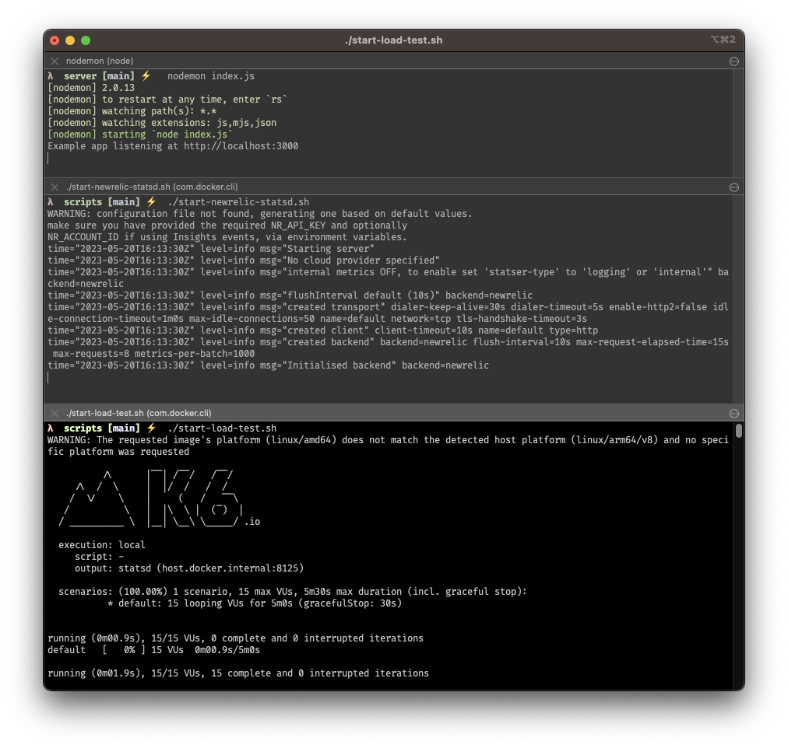

# K6 -> new relic

This is an example project that shows how you can use docker to run k6 load tests.

All the docker commands are captured in script files.

## Setup

### install node modules (within the server directory)

```sh
yarn
```

### setup environment variables for new relic account

* create a `.env` from the `.env.example`, 
  ```sh
  cp .env.example .env
  ```

* fill in the required new relic account information

## Running

You'll want to use multiple shell windows to get output from all the server and services that are running. 

### shell 1 (within the server directory)

```sh
nodemon index.js
```

shell 2 (within the scripts directory)

```sh
./start-newrelic-statsd
```

shell 3 (within the scripts directory)

```sh
./start-load-test.js
```

